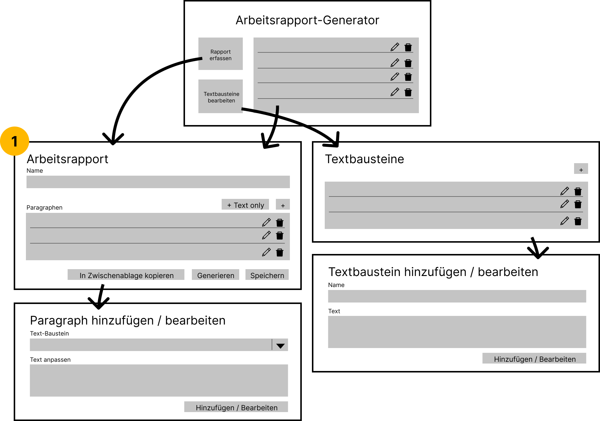

# Arbeitsrapport-Generator
Dies ist ein Arbeitsrapport-Generator programmiert in Java.

## 1 Projekt Regeln ⏩
Folgende Regeln müssen beim Mitwirken in diesem Projekt eingehalten werden.
### 1.1 Commits
In den Commits muss nach folgende Aufbau gearbeitet werden.
```
Typ: Titel

Body

Footer
```
#### Typ
Der Typ muss hierbei einem der folgenden Typen entsprechen:
* **feat:** Ein neues Feature
* **fix:** Die Behebung eines Bugs
* **docs:** Ergänzung einer Dokumentation
* **refactor:** Refactoring von Code
#### Titel
Der Titel ist eine kurze Zusammenfassung der Änderungen
#### Body
Im Body werden alle Änderungen genau beschrieben. Dabei wird vor allem das _was_ und teilweise auch das _wieso_ beantwortet
#### Footer
Im Footer wird angegeben, welche Issues/Pull Request dieser Commit betraf.
#### Ausnahmen
In Commits, in welchen ein Branch in den anderen gemerged wird oder in welchem nur das README.md angepasst wird, kann obiger Aufbau weggelassen werden, da bei diesen Aktionen bei beiden immer dasselbe gemacht wird
### 1.2 Branching 

## 2 Planung 📁
### 2.1 Entwurf der Applikation
Anhand des Punktes 5 - "Kontextszenario" - in der Projektskizze überlegten wir uns, wie genau die Applikation aufgebaut werden
soll. In dieser sprachen wir noch von verschiedenen Reitern. Aufgrund der Usability haben wir uns nun umentschieden
und beschlossen mit verschiedenen Fenstern zu arbeiten. Zudem war das Konzept mit den verschiedenen Reitern aus unserer
Sicht nicht selbsterklärend, wie wir es in den Anforderungen beschrieben hatten. <br>
Nebst dem User Interface haben wir des Weiteren auch die Funktionsweise verfeinert, da nicht klar definiert war wie genau
die Textbausteine zu einem Rapport angeordnet werden sollen. Neu haben wir das so angedacht, dass der Rapport grundsätzlich
eine Auflistung von mehreren Paragrafen (siehe **Punkt 1**) ist, welche in der Reihenfolge verschoben werden können. Zudem sind
die Elemente, welche in die Arbeitsrapport-Liste eingefügt werden keine Textbausteine, sondern Paragrafen. Dies sind Textbausteine,
welche jedoch noch temporäre Änderungen besitzen können. <br>

### 2.2 Meilensteine / Umsetzungsplan
Aufgrund der Grobplanung in der Projektskizze kamen wir auf drei Meilensteine:
1. [Setup](https://github.zhaw.ch/PM2-IT21tbWIN-scmy-pero-pasu/team06-cydatino-projekt2-arbeitsrapport/milestone/2)
2. [Applikation lauffähig](https://github.zhaw.ch/PM2-IT21tbWIN-scmy-pero-pasu/team06-cydatino-projekt2-arbeitsrapport/milestone/3)
3. [Projekt fertiggestellt](https://github.zhaw.ch/PM2-IT21tbWIN-scmy-pero-pasu/team06-cydatino-projekt2-arbeitsrapport/milestone/1)
#### Setup (Meilenstein: Setup, 28. April 2022)
In der Setup-Phase wird das Projekt aufgesetzt, die grundlegende Projektstruktur angelegt sowie das UI mit einfachen Interaktionen
angelegt.
* Branch: `setup`
#### Umsetzung (Meilenstein: Applikation lauffähig, 8. Mai 2022)
In der Umsetzungsphase soll die gesamte Funktionalität implementiert werden.
* Branch: `develop`
#### Abschluss (Meilenstein: Projekt fertiggestellt, 12. Mai 2022)
Die Phase Abschluss dient Aufräumarbeiten, Ergänzung noch fehlender Dokumentation und der Behebung letzter Fehler.<br>
* Branch: `develop`

## 3 Team-Mitglieder 🧑🏽‍💻 
* Cyrill (bergecyr@students.zhaw.ch)
* Dario (brunndar@students.zhaw.ch)
* Noah (baumgnoa@students.zhaw.ch)
* Timo (sigritim@students.zhaw.ch)
